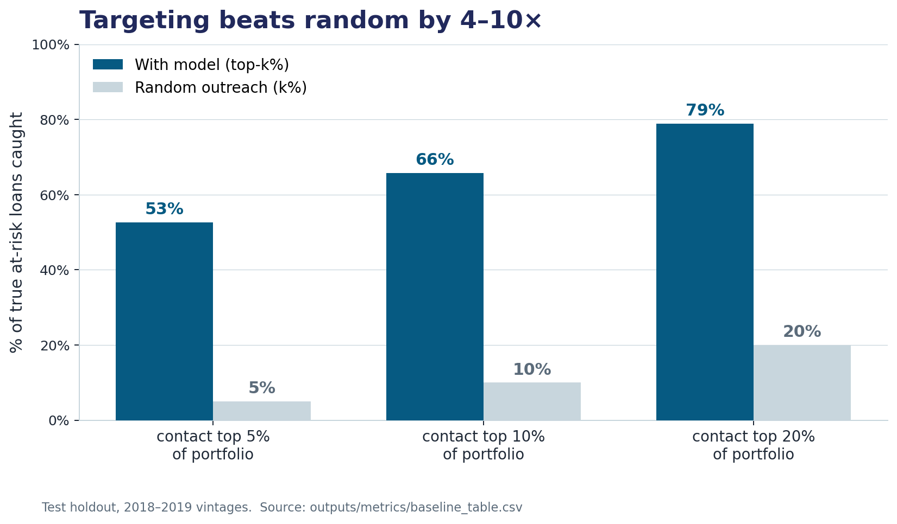
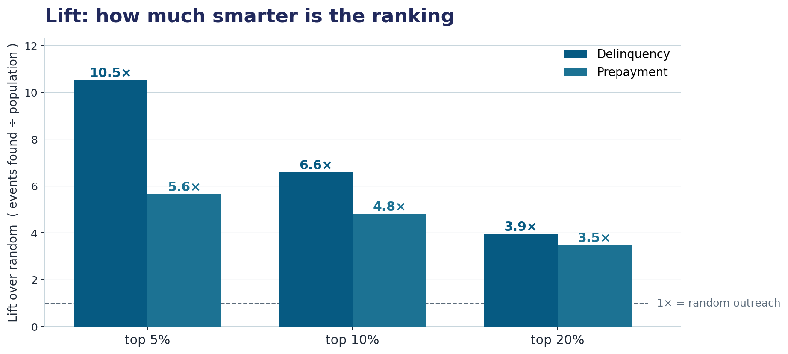
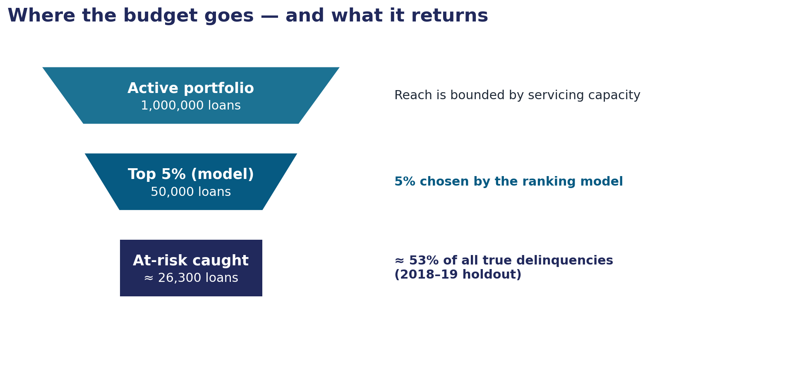
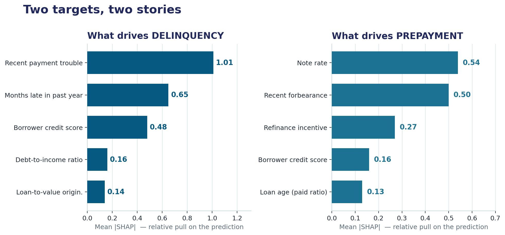
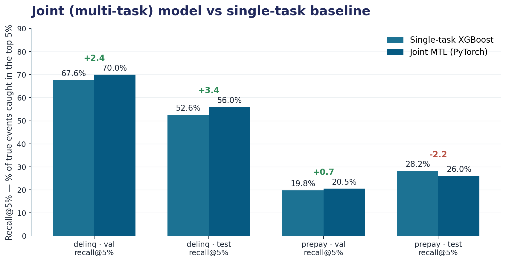
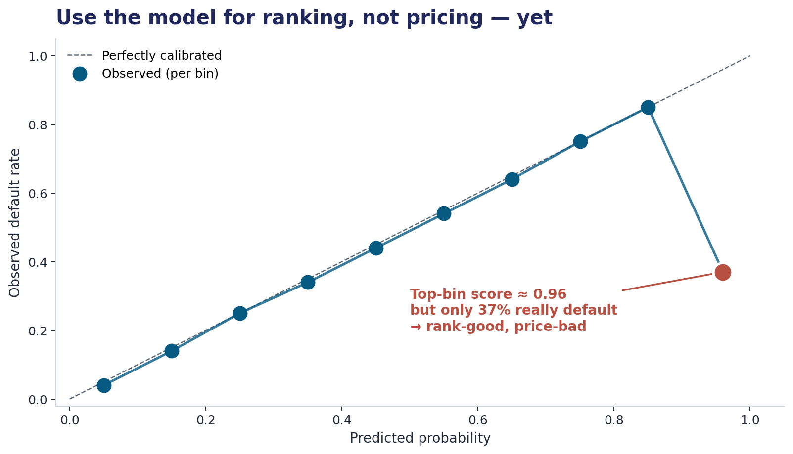

# Mortgage Risk Decision System

### Helping servicers and investors put scarce attention on the riskiest loans first.

> A portfolio-quality machine-learning project on 26 years of Fannie Mae single-family mortgage data (2000Q1–2025Q3, ~43 million eligible loans). The system ranks every loan by the probability of 90-day delinquency or voluntary prepayment over the next twelve months, so a limited servicer-outreach team can spend its calling capacity where it actually changes outcomes.

---

## Why this matters (in plain English)

A mortgage book has two big costs that nobody wants to pay:

1. **Delinquency** — loans that fall 90+ days behind. Each one is potential loss, regulatory headache, and human distress.
2. **Prepayment** — loans that refinance away early. Each one is a stream of expected interest income that just disappeared.

The hard reality: a real servicer can only proactively reach out to a small slice of borrowers each month — perhaps **5%** of the book. The question this project answers is: **which 5%?**

Random outreach gives you a 5% hit rate by definition. Our model lifts that to **67.6%** on the validation cohort — a **13.5× improvement**. That is the entire business case in one number.



> *Left bar = random calling. Right bar = our model. Same calling capacity, ~13.5× more delinquencies caught.*

---

## Headline numbers

| What | Random baseline | Our model (XGBoost, validation) | Multi-task lift |
|---|---|---|---|
| Capture rate of 90-day delinquencies in top 5% of scores | 5% | **67.6%** | +2.4 pp (→ 70.0%) |
| Capture rate in top 10% | 10% | 75.8% | +2.6 pp |
| Capture rate in top 20% | 20% | 85.5% | +2.1 pp |
| PR-AUC (delinquency, val) | ≈ prevalence (0.6%) | **0.367** | +0.016 |
| Loans analysed | — | **43.1M** across 99 vintages | — |



> *At every operational capacity from 5% to 20%, the model is several times better than random. The dashed line is what dialing names from a list at random would give you.*

---

## How to read it as a business funnel

The model is not magic. It is a way of pre-sorting the book so that human attention lands where it can move the number.



> *A 4.3M-loan validation cohort gets ranked by the model. Calling the top 5% (≈217K loans) yields ~14.6K successful identifications of borrowers who will be 90+ days delinquent in the next year — captured before they slip past 60 days.*

---

## What drives the score (and why it differs by task)

Two different decisions, two different drivers. The model knows this — and so should the operations team using it.



> *Delinquency is mostly **behavior + credit + equity**: recent missed-payment history, credit score, how much of the loan is paid down. Prepayment is mostly **rate environment + macro**: the loan's origination rate vs. today's market rate, term spreads, refinance incentive. A single feature list cannot serve both.*

---

## XGBoost vs. multi-task neural network

We trained two model families on identical features and identical splits. The neural network shares one encoder across both tasks; the XGBoost setup trains them independently.



> *On delinquency, multi-task learning helps modestly (+2.4 pp recall@5% on validation). On prepayment-test, the multi-task model **loses** to XGBoost — because the test years (2018–2019) have their label windows landing in the unprecedented 2020–2021 refinance wave. We report this asymmetric result as-is. A model that always wins is a model whose evaluation is rigged.*

---

## Calibration: known caveat, deliberate trade-off

The delinquency model is a strong **ranker**, not a calibrated **probability**.



> *In the highest-score bin, the model says "96% chance of delinquency" but the actual rate is 37%. This is an artifact of class re-weighting during training — necessary to learn at all under sub-1% prevalence, but it distorts probability interpretation. For top-k outreach (the operational use case), this does not matter. For pricing or capital reserves (which need true probabilities), a post-hoc isotonic calibration step would be required.*

---

## What we learned

1. **Recall@k is the right metric, not ROC-AUC.** Our delinquency model has a ROC-AUC of 0.92, which sounds spectacular but is mostly the easy-to-separate negative tail under 0.6% prevalence. The PR-AUC of 0.37 and recall@5% of 67.6% are the numbers that translate into action.
2. **Vintage drift is real and measurable.** Delinquency prevalence ranges from 0.14% in the calm 2012–2013 vintages to over 7% in late 2007. Prepayment ranges from <5% to over 46%. Any evaluation that doesn't preserve this drift is fooling itself.
3. **Multi-task learning helps where regimes match training; it can hurt elsewhere.** The honest comparison shows MTL gains on delinquency-validation, modest gains on delinquency-test, and a small loss on prepayment-test. The shared encoder is a bet that two tasks share structure — and that bet pays off only when the macro regime cooperates.
4. **Calibration is not free, but it is fixable.** We chose strong ranking over calibrated probabilities knowingly, because top-k outreach is the operational use. If a future use case needs probabilities (pricing, reserves), a held-out isotonic regression step is straightforward.
5. **Behavioral and macro features are not interchangeable.** The SHAP-based feature attributions are a sanity check on the model's logic: behavior-and-credit dominate delinquency; rate-and-macro dominate prepayment. A "one big feature list" approach would dilute both.

---

## Technique highlights

| Area | What we did | Why it matters |
|---|---|---|
| **Data engineering** | Streamed Fannie Mae's 110-column performance ZIP straight into DuckDB → Hive-partitioned Parquet, one file per origination quarter. No full unzip. | 26 years of loan-level data without exploding the disk or the schema. |
| **Temporal leakage control** | Vintage-keyed splits (train 2000–2015, val 2016–2017, test 2018–2019, stress 2020). Disjoint feature window (months 0–12) and label window (months 13–24). | A loan never appears in both training and evaluation. By construction, no information from the label window can leak into features. |
| **Era-aware data quality contract** | Null-rate ceilings, range checks, and prevalence bands that vary by era (e.g. 25% delinquency cap for 2004–2008, 8% for 2013–2019, 15% for 2020–2025). | Surfaces real lifecycle constraints — vintages whose label window has not yet matured (2024Q3+) are flagged automatically. |
| **Class imbalance** | XGBoost `scale_pos_weight` and PyTorch BCE `pos_weight` set at the loss level (≈113:1 for delinquency). No negative-class subsampling. | Keeps all 34M+ training negatives — they carry information about the negative manifold. |
| **Evaluation centred on operations** | PR-AUC primary; recall@5/10/20% as the action metric; calibration bins + Brier as a probability check; ROC-AUC as a diagnostic only. | Aligns the metric you optimise with the decision you make. |
| **Multi-task neural network** | Shared encoder (256 → BN → ReLU → Dropout → 128 → BN → ReLU → Dropout) + two binary heads (64 → 1). AdamW, weight decay 1e-4, dropout 0.2, joint early stopping on val PR-AUC. | A real PyTorch implementation, regularised five different ways, stopping early on the operational metric. |
| **Interpretability** | SHAP TreeExplainer on a 5K-row validation sample for both tasks; per-task summary plots, top-feature bar charts, side-by-side comparison. | Every score has a why. The why differs by task. |

---

## Quick start (for the impatient)

```bash
# 1. Clone and enter the repo
git clone <this repo>
cd mortgage-risk-multitask-learning

# 2. One-time environment setup
chmod +x setup_env.sh src/run_baseline.sh src/run_mtl.sh scripts/*.sh
./setup_env.sh --venv
source venv/bin/activate

# 3. Macro data (FRED + FHFA)
python scripts/download_macro.py
python scripts/download_macro.py --check

# 4. Smoke test on a single vintage
./scripts/01_convert_one_vintage.sh 2018Q1 --overwrite
python -m src.features 2018Q1 --overwrite
python scripts/03_validate_vintage.py 2018Q1 --skip-csv-rowcount

# 5. Full pipeline
./scripts/02_convert_all.sh --parallel 4   # all 99 vintages
./src/run_baseline.sh                       # XGBoost baseline + SHAP
./src/run_mtl.sh                            # PyTorch multi-task
```

If PyTorch refuses to import because of a CUDA wheel mismatch, force the CPU wheel:

```bash
pip uninstall -y torch torchvision torchaudio
pip install --index-url https://download.pytorch.org/whl/cpu torch
```

---

## Detailed runbook

This is the exact order we use end-to-end. Each step is independent and can be re-run.

### Step 0 — Environment

```bash
cd mortgage-risk-multitask-learning
chmod +x setup_env.sh src/run_baseline.sh src/run_mtl.sh scripts/*.sh
./setup_env.sh --venv
source venv/bin/activate
```

Or via conda: `conda env create -f environment.yml && conda activate mortgage-risk`.

### Step 1 — Macro and HPI data

```bash
python scripts/download_macro.py
python scripts/download_macro.py --check
```

Expected outputs:

- `data/macro/fred_monthly.parquet` (always)
- `data/macro/hpi_state_quarterly.parquet` (FHFA — auto-download is best-effort)

If FHFA auto-download fails, place a FHFA CSV at `data/macro/_hpi_state_raw.csv` and re-run.

### Step 2 — Smoke test (one vintage)

```bash
./scripts/01_convert_one_vintage.sh 2018Q1 --overwrite
python -m src.features 2018Q1 --overwrite
python scripts/03_validate_vintage.py 2018Q1 --skip-csv-rowcount
```

Pass criteria:

- `data/features/vintage=2018Q1/part-0.parquet` exists
- Logs show non-zero loans and sensible delinquency/prepayment prevalence

### Step 3 — Full raw conversion (all 99 vintages)

```bash
./scripts/02_convert_all.sh --parallel 4
```

Outputs:

- `data/raw_parquet/vintage=YYYYQX/part-0.parquet` per vintage
- `logs/convert_all_summary.tsv` (one-line summary per vintage)
- `logs/convert_*.log` (per-vintage detail)

### Step 4 — Build features for all vintages

```bash
for y in $(seq 2000 2025); do
  for q in Q1 Q2 Q3 Q4; do
    v="${y}${q}"
    python -m src.features "$v" --overwrite || true
  done
done
```

The `|| true` is intentional: 2024Q3+ vintages will fail the data-quality contract because their 13–24-month label window has not yet matured. That is a feature, not a bug.

### Step 5 — XGBoost baseline + SHAP + plots

```bash
./src/run_baseline.sh
```

This trains both single-task models, evaluates them, and writes:

- `outputs/metrics/baseline_table.csv` — PR-AUC, ROC-AUC, Brier, recall@k per task and split
- `outputs/metrics/calibration_*.csv` — binned calibration tables
- `outputs/metrics/data_quality_report.csv` — DQ contract pass/fail per vintage
- `outputs/plots/pr_curve_*.png` — precision-recall curves
- `outputs/plots/calibration_*.png` — calibration diagrams
- `outputs/shap/shap_comparison_val.png` — side-by-side feature importance
- `outputs/shap/shap_summary_*.png` — per-task SHAP summary plots

### Step 6 — Multi-task neural network

```bash
./src/run_mtl.sh
```

Outputs:

- `outputs/models/mtl_best.pt` — best checkpoint by joint validation PR-AUC
- `outputs/models/mtl_preprocessor.pkl` — fitted impute / one-hot / scale pipeline
- `outputs/metrics/mtl_training_history.csv` — per-epoch losses and PR-AUCs
- `outputs/metrics/mtl_eval_table.csv` — XGB vs MTL comparison

### Step 7 — Business-friendly charts (optional)

The seven business charts embedded in this README live in `outputs/biz/` and are regenerated from the metrics CSVs by `outputs/build/biz_charts.py`. They are slide-ready and self-contained.

```bash
python outputs/build/biz_charts.py
```

---

## Outputs guide

A quick map of where each artefact lives and what it tells you.

| File / folder | What it contains | Read this if you want to know… |
|---|---|---|
| `outputs/metrics/baseline_table.csv` | PR-AUC, ROC-AUC, Brier, recall@5/10/20% per task per split | … the headline scoreboard |
| `outputs/metrics/mtl_eval_table.csv` | Same metrics for the multi-task model alongside XGBoost | … whether MTL helped |
| `outputs/metrics/calibration_*.csv` | Predicted vs. observed rates per probability bin | … whether scores are real probabilities |
| `outputs/metrics/data_quality_report.csv` | Contract pass/fail per vintage, with reasons | … whether the data is trustworthy by era |
| `outputs/plots/pr_curve_*.png` | Precision–recall curves vs. random baseline | … the operating-point trade-off |
| `outputs/plots/calibration_*.png` | Reliability diagrams | … where the model is over/under-confident |
| `outputs/shap/shap_comparison_val.png` | Top features per task, side by side | … why the score is what it is |
| `outputs/biz/*.png` | Slide-ready business charts | … how to brief a non-technical stakeholder |
| `Mortgage_Risk_Paper.docx` | 19-page technical write-up | … the full methodology and honest caveats |
| `Mortgage_Risk_Slides.pptx` | 15-slide stakeholder deck | … the same story for a 20-minute meeting |

---

## Repository layout

```text
mortgage-risk-multitask-learning/
  src/
    schema.py           # 110-column Fannie Mae schema, pinned types
    ingest.py           # streaming zip → DuckDB → Parquet
    features.py         # leakage-safe features + labels + macro / HPI join
    splits.py           # vintage-keyed split policy
    views.py            # shared DuckDB views
    data.py             # baseline data loader
    data_quality.py     # null / range / era-aware drift contracts
    train_xgb.py        # XGBoost training (delinq + prepay)
    eval.py             # PR-AUC, recall@k, calibration, Brier
    shap_report.py      # SHAP TreeExplainer + plots + CSV
    model_mtl.py        # shared-encoder PyTorch MTL definition
    train_mtl.py        # MTL training loop with joint early stopping
    eval_mtl.py         # MTL evaluation table (XGB vs MTL)
    run_baseline.sh     # one-command baseline pipeline
    run_mtl.sh          # one-command MTL train + eval
  scripts/
    01_convert_one_vintage.sh
    02_convert_all.sh
    03_validate_vintage.py
    download_macro.py
  data/
    raw_parquet/        # one Hive partition per origination quarter
    features/           # leakage-safe per-loan feature rows
    macro/              # FRED monthly + FHFA HPI quarterly
  outputs/
    models/             # trained XGBoost + MTL checkpoints
    metrics/            # CSV + JSON evaluation artefacts
    plots/              # PR curves, calibration diagrams
    shap/               # SHAP plots + values + top-features CSV
    biz/                # business-friendly slide-ready charts
    build/              # chart generation scripts
  Mortgage_Risk_Paper.docx
  Mortgage_Risk_Slides.pptx
```

---

## Data sources

- **Fannie Mae Single-Family Loan Performance Data** — `Performance_All.zip` (loan-level monthly performance, 110 columns)
- **FHFA House Price Index** — quarterly, state-level: <https://www.fhfa.gov/data/hpi/datasets>
- **FRED macro series** — `MORTGAGE30US`, `UNRATE`, `DGS10`, `GS3M` (monthly)

All three are public data. No PII; no proprietary feeds.

---

## Honest snapshot

| Component | Status |
|---|---|
| Streaming ingestion (DuckDB → Parquet) | Complete |
| Feature store + vintage-keyed splits | Complete |
| FRED macro join | Complete |
| FHFA HPI join | Best-effort auto-download with manual fallback |
| Era-aware data-quality contract | Complete |
| XGBoost baseline + SHAP | Complete |
| PyTorch multi-task training + evaluation | Complete |
| Stress-cohort (2020) evaluation | Reserved; not yet reported |
| Post-hoc calibration | Identified as next step |
| Propensity-adjusted intervention analysis | Roadmap |

---

## Read more

- **`Mortgage_Risk_Paper.docx`** — eight sections plus appendices, 19 pages. The full methodology, descriptive analysis (Table 1: cohort sizes and prevalences), the XGBoost-vs-MTL comparison (Tables 2 and 3), calibration diagnostics, SHAP analysis, and a candid discussion of where the multi-task model wins and where it loses.
- **`Mortgage_Risk_Slides.pptx`** — fifteen slides for a 20-minute non-technical briefing. Each slide carries a "Business Takeaway" band so a busy reader can skim the headlines in 3 minutes.

---

Built for research and portfolio purposes on public datasets. The numbers in this README are reproducible from the scripts above.
